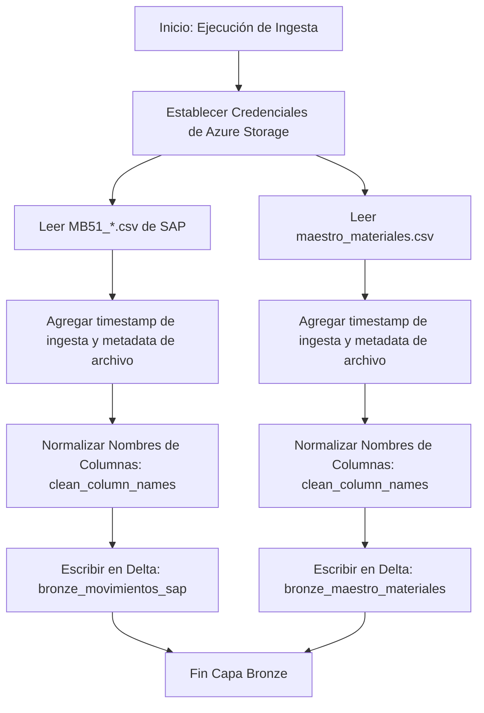
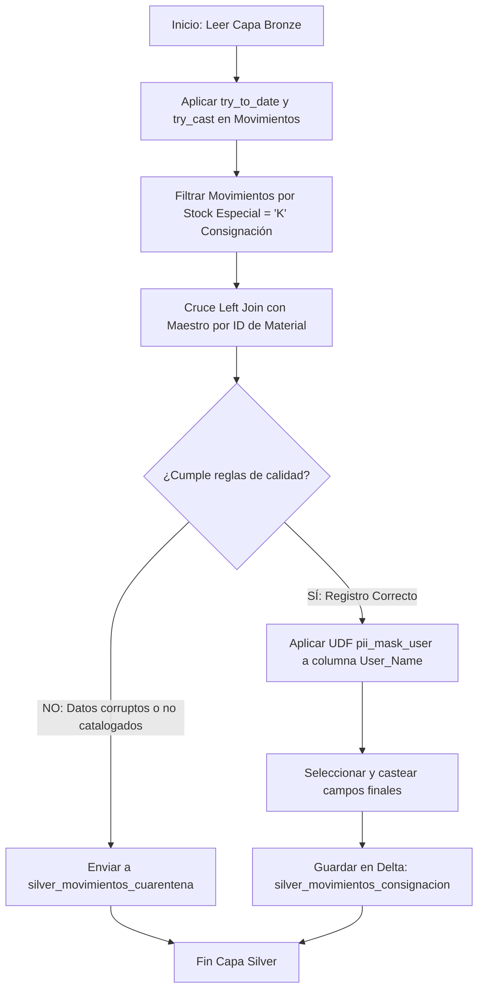
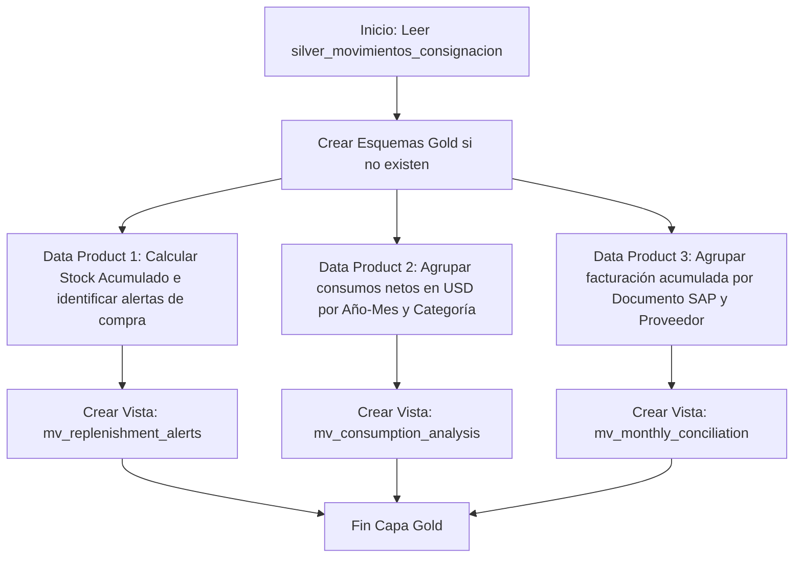
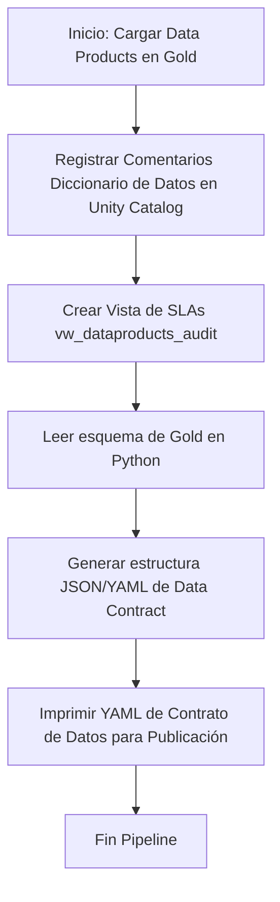

# Análisis de Flujo y Pseudocódigo: Arquitectura Medallion & Data Mesh
## Compañía Minera Los Andes S.A. - Control de Consignación (Grupo G2 - g102)

Este documento detalla el comportamiento interno de cada uno de los 4 notebooks del pipeline Medallion, sus diagramas de flujo y las interconexiones semánticas entre los 3 Data Products en el ecosistema de **Data Mesh**.

---

## 1. Mapa de Conexión de los Data Products (Data Mesh)

En una arquitectura de **Data Mesh**, los Data Products no están aislados; se alimentan de fuentes comunes y comparten lógica para retroalimentar las decisiones de la compañía.

### Diagrama de Relación del Ecosistema (Mermaid)

```mermaid
graph TD
    %% Fuentes de Datos
    subgraph Capa Silver (Esquema Unificado)
        Silver[silver_movimientos_consignacion]
    end

    %% Data Products (Gold Layer)
    subgraph Capa Gold (Data Products)
        DP1[DP1: Reabastecimiento Crítico<br>mv_replenishment_alerts]
        DP2[DP2: Consumo y Costos<br>mv_consumption_analysis]
        DP3[DP3: Conciliación de Pagos<br>mv_monthly_conciliation]
    end

    %% Consumidores de Negocio
    subgraph Consumidores
        Mantenimiento[Planeamiento de Mantenimiento]
        Logistica[Gerencia de Logística y Contratos]
        Finanzas[Contabilidad y Proveedores]
    end

    %% Flujos de Alimentación
    Silver -->|Alimenta stocks| DP1
    Silver -->|Alimenta salidas netas| DP2
    Silver -->|Alimenta transacciones| DP3

    %% Conexiones e Interdependencias Semánticas
    DP2 -->|Retroalimenta políticas:<br>Reajuste de Stock de Seguridad| DP1
    DP2 -.->|Conciliación y Auditoría:<br>Validación de Montos Consumidos| DP3

    %% Consumo Final
    DP1 --> Mantenimiento
    DP2 --> Logistica
    DP3 --> Finanzas
```

### Explicación de las Conexiones:
1. **Retroalimentación de Políticas (DP2 ➡️ DP1):** El **DP2 (Análisis de Consumo)** calcula el consumo promedio mensual real. Si este análisis detecta que el consumo de una categoría (ej. Aceites Shell) se ha duplicado en los últimos 3 meses, esta información sirve para que el planeador actualice y suba el `Stock_Seguridad` y el `Punto_Reorden` en el maestro de materiales. Así, el **DP1 (Reabastecimiento)** ajusta sus alertas previniendo quiebres de stock.
2. **Validación Contable (DP2 ➡️ DP3):** El **DP2 (Consumo)** y el **DP3 (Conciliación)** representan dos caras de la misma moneda. Cada dólar reportado como "Costo de Consumo" en el DP2 debe conciliarse centavo a centavo con el "Monto Facturable" en el DP3. Si el DP2 dice que se consumieron \$10,000 en el mes, Finanzas valida en el DP3 que la suma de los documentos de material aprobados sea exactamente \$10,000.

---

## 2. Flujo y Pseudocódigo por Notebook

---

### 📓 Notebook 1: Capa Bronze (Ingesta Inmutable)

#### Diagrama de Flujo (Notebook 1)


#### Pseudocódigo
```python
INICIO
    # 1. Configurar credenciales
    Configurar llave de Azure Storage "stdemdsai.dfs.core.windows.net" en Spark Session

    # 2. Leer archivos crudos desde ADLS Gen2
    LEER df_mov_raw DESDE "abfss://.../G2/MB51_*.csv" CON OPCIONES (Header=True, InferSchema=True)
    LEER df_maestro_raw DESDE "abfss://.../G2/maestro_materiales.csv" CON OPCIONES (Header=True, InferSchema=True)

    # 3. Enriquecer con metadatos técnicos inmutables
    AÑADIR columna "ingested_at" con fecha_hora_actual() a df_mov_raw y df_maestro_raw
    AÑADIR columna "file_source_name" con metadata.file_path a df_mov_raw y df_maestro_raw

    # 4. Limpiar nombres de columnas (Delta Lake no permite espacios ni puntos)
    PARA cada columna EN df_mov_raw:
        Limpiar espacios en blanco al inicio y fin
        Reemplazar " ", ".", ";" por "_"
        Reemplazar "{", "}", "(", ")" por cadena vacía
        Renombrar columna original con el nuevo nombre limpio

    Hacer lo mismo para df_maestro_raw

    # 5. Guardar físicamente en formato Delta en Unity Catalog
    GUARDAR df_mov_raw EN TABLA "g102_log_reabastecimiento.bronze.bronze_movimientos_sap" MODO "overwrite"
    GUARDAR df_maestro_raw EN TABLA "g102_log_reabastecimiento.bronze.bronze_maestro_materiales" MODO "overwrite"
FIN
```

---

### 📓 Notebook 2: Capa Silver (Calidad, PII y Enriquecimiento)

#### Diagrama de Flujo (Notebook 2)


#### Pseudocódigo
```python
INICIO
    # 1. Leer tablas Bronze
    LEER df_mov DESDE "bronze.bronze_movimientos_sap"
    LEER df_maestro DESDE "bronze.bronze_maestro_materiales" (Renombrar Material_Description para evitar duplicados)

    # 2. Lógica resiliente de transformación básica
    df_mov_clean = df_mov con:
        Material_Id = casting a string de columna "Material"
        Posting_Date = intentar parsear fecha como (yyyy-MM-dd), sino como (d/M/yyyy), si falla retornar NULL
        Qty = intentar castear "Quantity" a double, si es texto malformado retornar NULL
        Amount_Loc_Cur = intentar castear "Amt_in_Loc_Cur_" a double, si falla retornar NULL
        Filtro de negocio: conservar registros donde Special_Stock es igual a "K"

    # 3. Enriquecer cruzando con el maestro de materiales (Left Join)
    df_joined = df_mov_clean LEFT JOIN df_maestro EN df_mov_clean.Material_Id == df_maestro.Material

    # 4. Evaluación de Calidad de Datos (Cuarentena)
    Definir condicion_cuarentena:
        Si "Qty" es NULL O "Qty" es 0 O "Proveedor" es NULL (no cruzó con maestro) O "Posting_Date" es NULL

    df_cuarentena = filtrar df_joined donde condicion_cuarentena es VERDADERA
    df_silver_clean = filtrar df_joined donde condicion_cuarentena es FALSA

    # 5. Guardar tabla de Cuarentena (Auditabilidad de errores en origen SAP)
    SELECCIONAR campos originales y motivo del error
    GUARDAR df_cuarentena EN TABLA "silver.silver_movimientos_cuarentena" MODO "append"

    # 6. Gobernanza PII (Enmascaramiento Dinámico de Datos Sensibles)
    UDF SQL pii_mask_user(User_Name):
        SI el usuario consultor pertenece al grupo 'utec-admin':
            RETORNAR User_Name sin cambios
        SINO:
            RETORNAR enmascarar(User_Name) con asteriscos (ej. *******)

    Aplicar UDF: usuario_sap_masked = pii_mask_user("User_Name")

    # 7. Guardar Capa Silver Limpia
    SELECCIONAR columnas finales del negocio con tipos correctos
    GUARDAR df_silver_clean EN TABLA "silver.silver_movimientos_consignacion" MODO "overwrite"
FIN
```

---

### 📓 Notebook 3: Capa Gold (Data Products)

#### Diagrama de Flujo (Notebook 3)


#### Pseudocódigo
```python
INICIO
    ASEGURAR esquemas "gold" en los catálogos "reabastecimiento", "consumos" y "conciliacion"

    # -------------------------------------------------------------
    # DATA PRODUCT 1: ALERTAS DE REABASTECIMIENTO CRÍTICO
    # -------------------------------------------------------------
    CREAR VISTA g102_log_reabastecimiento.gold.mv_replenishment_alerts AS:
        CON stock_acumulado COMO:
            SELECT material_id, descripcion, proveedor, categoria, stock_seguridad, punto_reorden, costo_unitario_usd,
                   SUM(cantidad) AS stock_actual
            FROM silver.silver_movimientos_consignacion
            GROUP BY material_id, descripcion, proveedor, categoria, stock_seguridad, punto_reorden, costo_unitario_usd
        
        SELECT material_id, descripcion, proveedor, categoria, stock_actual, stock_seguridad, punto_reorden,
               SI stock_actual < stock_seguridad ENTONCES 'CRITICO - DESABASTECIMIENTO'
               SI stock_actual < punto_reorden ENTONCES 'REORDEN SUGERIDO'
               SINO 'NORMAL' COMO estado_inventario,
               (punto_reorden - stock_actual) AS cantidad_a_comprar,
               ((punto_reorden - stock_actual) * costo_unitario_usd) AS costo_reposicion_usd
        FROM stock_acumulado
        WHERE stock_actual < punto_reorden; # Filtrar solo los que requieren atención

    # -------------------------------------------------------------
    # DATA PRODUCT 2: CONSUMO MENSUAL Y COSTOS
    # -------------------------------------------------------------
    CREAR VISTA g102_log_consumos.gold.mv_consumption_analysis AS:
        SELECT date_format(fecha_movimiento, 'yyyy-MM') AS anio_mes,
               material_id, descripcion, proveedor, categoria,
               ABS(SUM(cantidad)) AS cantidad_consumida,
               ABS(SUM(monto_total_usd)) AS costo_consumo_usd
        FROM silver.silver_movimientos_consignacion
        WHERE cantidad < 0  # Filtrar solo salidas netas (consumos)
        GROUP BY periodo, material_id, descripcion, proveedor, categoria;

    # -------------------------------------------------------------
    # DATA PRODUCT 3: CONCILIACIÓN DE FACTURACIÓN
    # -------------------------------------------------------------
    CREAR VISTA g102_fin_conciliacion.gold.mv_monthly_conciliation AS:
        SELECT date_format(fecha_movimiento, 'yyyy-MM') AS anio_mes,
               proveedor, documento_material, material_id, descripcion, costo_unitario_usd,
               ABS(SUM(cantidad)) AS cantidad_facturable,
               ABS(SUM(monto_total_usd)) AS monto_facturable_usd
        FROM silver.silver_movimientos_consignacion
        WHERE cantidad < 0  # Filtrar solo salidas netas
        GROUP BY periodo, proveedor, documento_material, material_id, descripcion, costo_unitario_usd;
FIN
```

---

### 📓 Notebook 4: Gobernanza, SLAs y Data Contracts

#### Diagrama de Flujo (Notebook 4)


#### Pseudocódigo
```python
INICIO
    # 1. Diccionario de Datos (Unity Catalog Meta-store)
    PARA cada columna del Data Product 1:
        Aplicar: COMMENT ON COLUMN mv_replenishment_alerts.nombre_columna IS 'Descripción del Negocio'
    
    Hacer lo mismo para Data Product 2 y 3

    # 2. Monitoreo de SLAs y SLOs del Portal
    CREAR VISTA g102_log_reabastecimiento.gold.vw_dataproducts_audit AS:
        SELECT fecha, 'Reabastecimiento' AS data_product, total_consultas, latencia_promedio, exitosas, fallidas
        UNION ALL
        SELECT fecha, 'Consumos' AS data_product, ...
        # (Mockeado para simular system.query.history debido a restricciones de privilegios de cuenta)

    # 3. Autogenerar Contrato de Datos (Data Contract)
    schema = LEER esquema de "gold.mv_replenishment_alerts"
    
    Inicializar estructura de contrato (YAML):
        data_product: "reabastecimiento"
        domain: "logistica"
        owner: "herles.pinedo@utec.edu.pe"
        expectations: freshness (updated_daily), rules (material_id not null)
        schema_fields: []

    PARA cada campo EN schema:
        Agregar al schema_fields:
            name: campo.name
            type: campo.dataType
            description: extraer_comentario_desde_catalog(campo.name)

    IMPRIMIR contrato de datos en formato YAML
FIN
```
